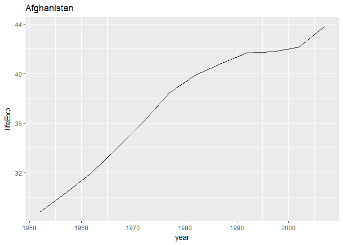
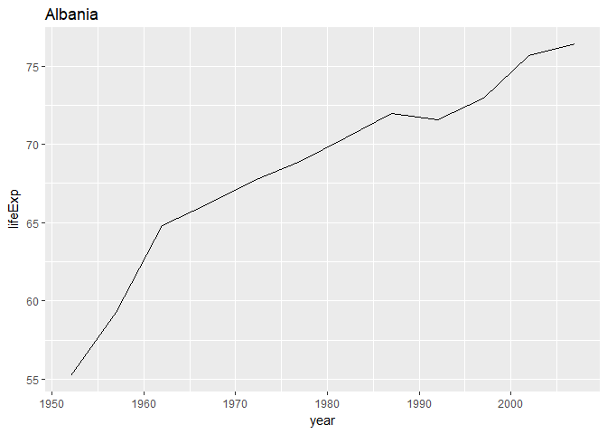
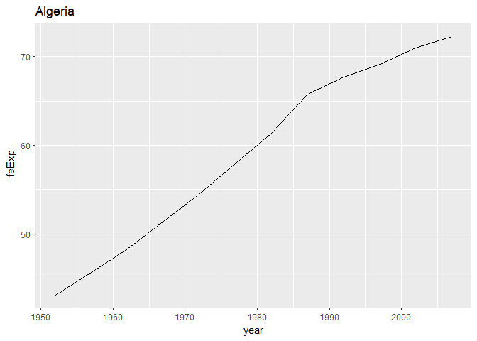
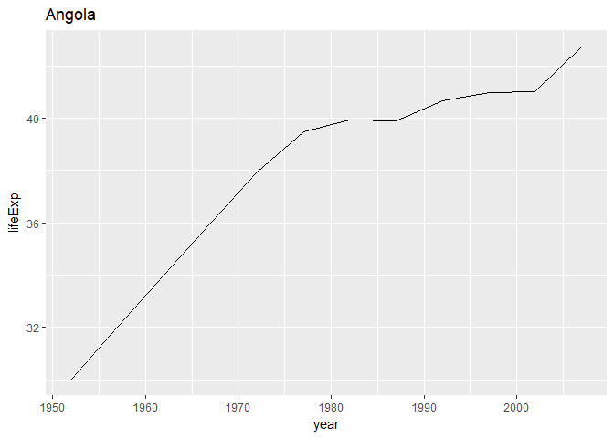
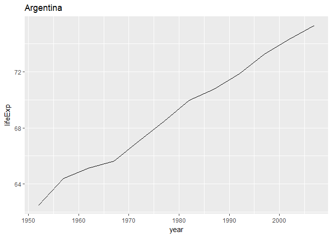
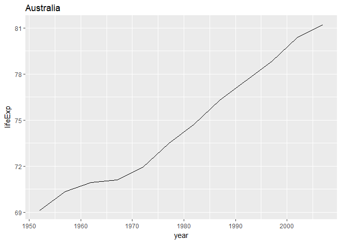
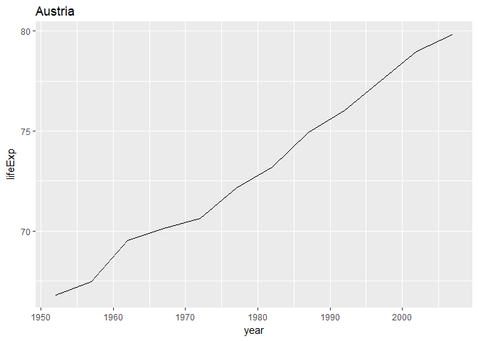
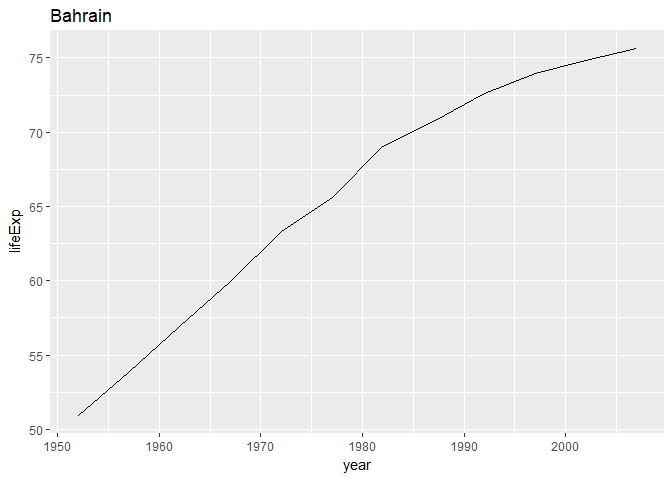
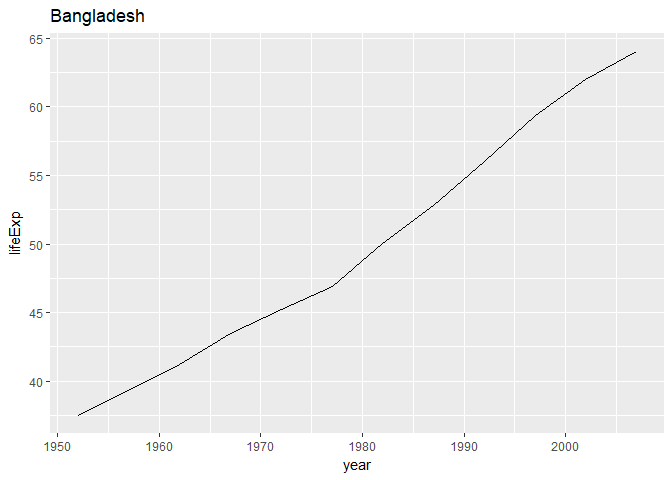
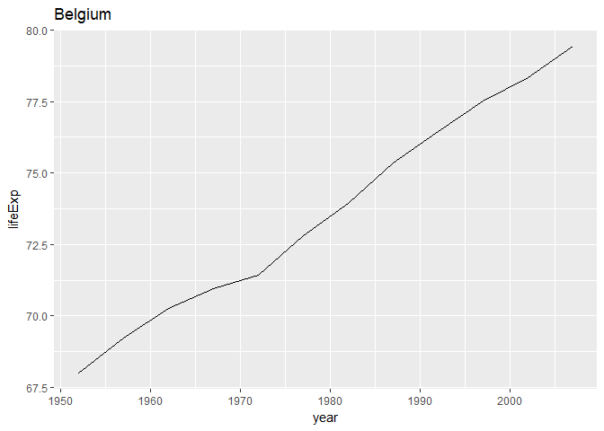

The idea of using purrr is to solve iteration problems by using:

1.  functions that write for loops for you
2.  with consistent syntax & output, and
3.  convenience shortcuts for specifying functions to iterate

Setup
-----

Checking if you have the packages

    library(tidyverse)
    library(repurrrsive) #devtools::install_github("jennybc/repurrrsive")

We will working with the sw\_people dataset that is in repurrrsive
package. It's a dataset about Star Wars characters, queried from the
[Star Wars API](https://swapi.co/).

Now, let's get our hands dirty and look at the data.

First, let's examine sw\_people.

    class(sw_people)

    ## [1] "list"

Okay, now we know that sw\_people is a list. Let's see how many elements
are there in sw\_people.

    length(sw_people)

    ## [1] 87

YOUR TURN:

1.  Who is the first person listed in sw\_people?
2.  What information is given for the first person?
3.  What is the difference between sw\_people\[1\] and sw\_people
    \[\[1\]\]

<!-- -->

    sw_people[[1]] # Luke Skywalker 

    ## $name
    ## [1] "Luke Skywalker"
    ## 
    ## $height
    ## [1] "172"
    ## 
    ## $mass
    ## [1] "77"
    ## 
    ## $hair_color
    ## [1] "blond"
    ## 
    ## $skin_color
    ## [1] "fair"
    ## 
    ## $eye_color
    ## [1] "blue"
    ## 
    ## $birth_year
    ## [1] "19BBY"
    ## 
    ## $gender
    ## [1] "male"
    ## 
    ## $homeworld
    ## [1] "http://swapi.co/api/planets/1/"
    ## 
    ## $films
    ## [1] "http://swapi.co/api/films/6/" "http://swapi.co/api/films/3/"
    ## [3] "http://swapi.co/api/films/2/" "http://swapi.co/api/films/1/"
    ## [5] "http://swapi.co/api/films/7/"
    ## 
    ## $species
    ## [1] "http://swapi.co/api/species/1/"
    ## 
    ## $vehicles
    ## [1] "http://swapi.co/api/vehicles/14/" "http://swapi.co/api/vehicles/30/"
    ## 
    ## $starships
    ## [1] "http://swapi.co/api/starships/12/" "http://swapi.co/api/starships/22/"
    ## 
    ## $created
    ## [1] "2014-12-09T13:50:51.644000Z"
    ## 
    ## $edited
    ## [1] "2014-12-20T21:17:56.891000Z"
    ## 
    ## $url
    ## [1] "http://swapi.co/api/people/1/"

    names(sw_people[[1]])

    ##  [1] "name"       "height"     "mass"       "hair_color" "skin_color"
    ##  [6] "eye_color"  "birth_year" "gender"     "homeworld"  "films"     
    ## [11] "species"    "vehicles"   "starships"  "created"    "edited"    
    ## [16] "url"

    sw_people[1] # A list inside a list

    ## [[1]]
    ## [[1]]$name
    ## [1] "Luke Skywalker"
    ## 
    ## [[1]]$height
    ## [1] "172"
    ## 
    ## [[1]]$mass
    ## [1] "77"
    ## 
    ## [[1]]$hair_color
    ## [1] "blond"
    ## 
    ## [[1]]$skin_color
    ## [1] "fair"
    ## 
    ## [[1]]$eye_color
    ## [1] "blue"
    ## 
    ## [[1]]$birth_year
    ## [1] "19BBY"
    ## 
    ## [[1]]$gender
    ## [1] "male"
    ## 
    ## [[1]]$homeworld
    ## [1] "http://swapi.co/api/planets/1/"
    ## 
    ## [[1]]$films
    ## [1] "http://swapi.co/api/films/6/" "http://swapi.co/api/films/3/"
    ## [3] "http://swapi.co/api/films/2/" "http://swapi.co/api/films/1/"
    ## [5] "http://swapi.co/api/films/7/"
    ## 
    ## [[1]]$species
    ## [1] "http://swapi.co/api/species/1/"
    ## 
    ## [[1]]$vehicles
    ## [1] "http://swapi.co/api/vehicles/14/" "http://swapi.co/api/vehicles/30/"
    ## 
    ## [[1]]$starships
    ## [1] "http://swapi.co/api/starships/12/" "http://swapi.co/api/starships/22/"
    ## 
    ## [[1]]$created
    ## [1] "2014-12-09T13:50:51.644000Z"
    ## 
    ## [[1]]$edited
    ## [1] "2014-12-20T21:17:56.891000Z"
    ## 
    ## [[1]]$url
    ## [1] "http://swapi.co/api/people/1/"

    sw_people[[1]] # A list, dropped one level of heirachy

    ## $name
    ## [1] "Luke Skywalker"
    ## 
    ## $height
    ## [1] "172"
    ## 
    ## $mass
    ## [1] "77"
    ## 
    ## $hair_color
    ## [1] "blond"
    ## 
    ## $skin_color
    ## [1] "fair"
    ## 
    ## $eye_color
    ## [1] "blue"
    ## 
    ## $birth_year
    ## [1] "19BBY"
    ## 
    ## $gender
    ## [1] "male"
    ## 
    ## $homeworld
    ## [1] "http://swapi.co/api/planets/1/"
    ## 
    ## $films
    ## [1] "http://swapi.co/api/films/6/" "http://swapi.co/api/films/3/"
    ## [3] "http://swapi.co/api/films/2/" "http://swapi.co/api/films/1/"
    ## [5] "http://swapi.co/api/films/7/"
    ## 
    ## $species
    ## [1] "http://swapi.co/api/species/1/"
    ## 
    ## $vehicles
    ## [1] "http://swapi.co/api/vehicles/14/" "http://swapi.co/api/vehicles/30/"
    ## 
    ## $starships
    ## [1] "http://swapi.co/api/starships/12/" "http://swapi.co/api/starships/22/"
    ## 
    ## $created
    ## [1] "2014-12-09T13:50:51.644000Z"
    ## 
    ## $edited
    ## [1] "2014-12-20T21:17:56.891000Z"
    ## 
    ## $url
    ## [1] "http://swapi.co/api/people/1/"

Wow, there is quite a lot of information for Luke and there're more than
one character in Star Wars! I'm interested to see how many starships has
each character been in.

First, let's start small by finding out how many starships does **Luke**
have.

    length(sw_people[[1]]$starships)

    ## [1] 2

So, if I want to know how many starships other characters have, what
should I change?

    length(sw_people[[2]]$starships)
    length(sw_people[[3]]$starships)
    length(sw_people[[4]]$starships)

But there are so many characters in sw\_people, how can we do that more
systemtically?

map()!
======

`map()` helps to solve an iteration problem like "for each element of .x
for .f" by using **map(.x, .f, ...)**.

In `map()`, there are two important inputs.

-   .x: the element you want to loop through: a vector, a list or a data
    frame (for each column)
-   .f: a function that you want to be applied to each element

In our example above, we want to solve: for **each person** in
sw\_people, the **number of starships** they have. As noted above, we
can use `length(x$starships)` to get the count of number of starships
they have.

    map(sw_people, ~length(.x$starships)) %>% head()

    ## [[1]]
    ## [1] 2
    ## 
    ## [[2]]
    ## [1] 0
    ## 
    ## [[3]]
    ## [1] 0
    ## 
    ## [[4]]
    ## [1] 1
    ## 
    ## [[5]]
    ## [1] 0
    ## 
    ## [[6]]
    ## [1] 0

For those who are familiar with for loops or s/lapply(), you will know
that we can get the same numbers by doing a foor loop:

    num_starship <- numeric()
    for (i in 1:length(sw_people)){
      num_starship[i] <- length(sw_people[[i]]$starships)
    }
    num_starship

    ##  [1] 2 0 0 1 0 0 0 0 1 5 3 0 2 2 0 0 1 1 0 0 1 0 0 1 0 0 0 1 0 1 0 0 0 0 0
    ## [36] 0 1 0 0 0 0 1 0 0 0 0 0 0 0 0 0 0 0 0 1 0 1 0 0 0 0 0 0 0 0 0 0 0 0 0
    ## [71] 0 0 0 0 0 0 1 0 0 0 0 0 0 1 0 0 3

or a sapply()

    sapply(sw_people, function(x) length(x$starships))

    ##  [1] 2 0 0 1 0 0 0 0 1 5 3 0 2 2 0 0 1 1 0 0 1 0 0 1 0 0 0 1 0 1 0 0 0 0 0
    ## [36] 0 1 0 0 0 0 1 0 0 0 0 0 0 0 0 0 0 0 0 1 0 1 0 0 0 0 0 0 0 0 0 0 0 0 0
    ## [71] 0 0 0 0 0 0 1 0 0 0 0 0 0 1 0 0 3

Why should we use `map()`?
==========================

The main advantage of `map()` is the helpers which allow you to write
compact code for common special cases. It also has much greater
consistency between the functions, for example, the first argument to
all map functions is always the data while it's different between
`lapply()` and `mapply()`. Hadley also commented on the comparison of
purrr and lapply on this [Stack Overflow
post](https://stackoverflow.com/questions/45101045/why-use-purrrmap-instead-of-lapply/47123420#47123420)
and his [Twitter
post](https://twitter.com/hadleywickham/status/927199362668814336).

Let's try to use map for another example. Let's find the name of each
character's home world.

We will use the variable, planet\_lookup that is created using the
following code, but we can ignore the code details for now.

    planet_lookup <- map_chr(sw_planets, "name")  %>%  # planets 
      set_names(map_chr(sw_planets, "url")) #name as the URL
    head(planet_lookup)

    ## http://swapi.co/api/planets/2/ http://swapi.co/api/planets/3/ 
    ##                     "Alderaan"                     "Yavin IV" 
    ## http://swapi.co/api/planets/4/ http://swapi.co/api/planets/5/ 
    ##                         "Hoth"                      "Dagobah" 
    ## http://swapi.co/api/planets/6/ http://swapi.co/api/planets/7/ 
    ##                       "Bespin"                        "Endor"

planet\_lookup is a named character that the URLs are the names and the
home world planet names are the value. In our sw\_people data, the home
world of each character is stored in sw\_people\[\[i\]\]$homeworld as a
URL.

    sw_people[[1]]$homeworld

    ## [1] "http://swapi.co/api/planets/1/"

We can use the URL as an index to find the planet name of Luke from
planet\_lookup.

    planet_lookup[sw_people[[1]]$homeworld]

    ## http://swapi.co/api/planets/1/ 
    ##                     "Tatooine"

Your turn! Can you use `map()` to find the name of each character's home
world?

**Tips**: think about what do we need to change to find it for each
character

    map(sw_people, ~planet_lookup[.x$homeworld]) %>% head()

    ## [[1]]
    ## http://swapi.co/api/planets/1/ 
    ##                     "Tatooine" 
    ## 
    ## [[2]]
    ## http://swapi.co/api/planets/1/ 
    ##                     "Tatooine" 
    ## 
    ## [[3]]
    ## http://swapi.co/api/planets/8/ 
    ##                        "Naboo" 
    ## 
    ## [[4]]
    ## http://swapi.co/api/planets/1/ 
    ##                     "Tatooine" 
    ## 
    ## [[5]]
    ## http://swapi.co/api/planets/2/ 
    ##                     "Alderaan" 
    ## 
    ## [[6]]
    ## http://swapi.co/api/planets/1/ 
    ##                     "Tatooine"

Other map functions
===================

As you can notice from our above example, the output from `map()` is
always a **list**.

Sometimes, we want to have the output in other simpler formats. There
are a few other functions in purrr that can help:

1.  **map\_lgl()** returns logical vector
2.  **map\_int()** returns integer vector
3.  **map\_dbl()** returns double vector (What is \[double
    vector\]?(<http://uc-r.github.io/integer_double/>))
4.  **map\_chr()** returns a character vector

Another function, `walk()` returns nothing at all, it's helpful in cases
where you:

1.  only want to print to screen
2.  plot to graphics device
3.  file maniuplation (saving, writing, moving, etc.)
4.  system calls

Your turn! Can you use map and the other typed functions to answer the
following question?

1.  How many starships has each character been in?
2.  What color is each character's hair?
3.  Is the character male?
4.  How heavy is each character?

<!-- -->

    # 1. How many starships has each character been in?
    map(sw_people, ~ length(.x[["starships"]]))

    ## [[1]]
    ## [1] 2
    ## 
    ## [[2]]
    ## [1] 0
    ## 
    ## [[3]]
    ## [1] 0
    ## 
    ## [[4]]
    ## [1] 1
    ## 
    ## [[5]]
    ## [1] 0
    ## 
    ## [[6]]
    ## [1] 0
    ## 
    ## [[7]]
    ## [1] 0
    ## 
    ## [[8]]
    ## [1] 0
    ## 
    ## [[9]]
    ## [1] 1
    ## 
    ## [[10]]
    ## [1] 5
    ## 
    ## [[11]]
    ## [1] 3
    ## 
    ## [[12]]
    ## [1] 0
    ## 
    ## [[13]]
    ## [1] 2
    ## 
    ## [[14]]
    ## [1] 2
    ## 
    ## [[15]]
    ## [1] 0
    ## 
    ## [[16]]
    ## [1] 0
    ## 
    ## [[17]]
    ## [1] 1
    ## 
    ## [[18]]
    ## [1] 1
    ## 
    ## [[19]]
    ## [1] 0
    ## 
    ## [[20]]
    ## [1] 0
    ## 
    ## [[21]]
    ## [1] 1
    ## 
    ## [[22]]
    ## [1] 0
    ## 
    ## [[23]]
    ## [1] 0
    ## 
    ## [[24]]
    ## [1] 1
    ## 
    ## [[25]]
    ## [1] 0
    ## 
    ## [[26]]
    ## [1] 0
    ## 
    ## [[27]]
    ## [1] 0
    ## 
    ## [[28]]
    ## [1] 1
    ## 
    ## [[29]]
    ## [1] 0
    ## 
    ## [[30]]
    ## [1] 1
    ## 
    ## [[31]]
    ## [1] 0
    ## 
    ## [[32]]
    ## [1] 0
    ## 
    ## [[33]]
    ## [1] 0
    ## 
    ## [[34]]
    ## [1] 0
    ## 
    ## [[35]]
    ## [1] 0
    ## 
    ## [[36]]
    ## [1] 0
    ## 
    ## [[37]]
    ## [1] 1
    ## 
    ## [[38]]
    ## [1] 0
    ## 
    ## [[39]]
    ## [1] 0
    ## 
    ## [[40]]
    ## [1] 0
    ## 
    ## [[41]]
    ## [1] 0
    ## 
    ## [[42]]
    ## [1] 1
    ## 
    ## [[43]]
    ## [1] 0
    ## 
    ## [[44]]
    ## [1] 0
    ## 
    ## [[45]]
    ## [1] 0
    ## 
    ## [[46]]
    ## [1] 0
    ## 
    ## [[47]]
    ## [1] 0
    ## 
    ## [[48]]
    ## [1] 0
    ## 
    ## [[49]]
    ## [1] 0
    ## 
    ## [[50]]
    ## [1] 0
    ## 
    ## [[51]]
    ## [1] 0
    ## 
    ## [[52]]
    ## [1] 0
    ## 
    ## [[53]]
    ## [1] 0
    ## 
    ## [[54]]
    ## [1] 0
    ## 
    ## [[55]]
    ## [1] 1
    ## 
    ## [[56]]
    ## [1] 0
    ## 
    ## [[57]]
    ## [1] 1
    ## 
    ## [[58]]
    ## [1] 0
    ## 
    ## [[59]]
    ## [1] 0
    ## 
    ## [[60]]
    ## [1] 0
    ## 
    ## [[61]]
    ## [1] 0
    ## 
    ## [[62]]
    ## [1] 0
    ## 
    ## [[63]]
    ## [1] 0
    ## 
    ## [[64]]
    ## [1] 0
    ## 
    ## [[65]]
    ## [1] 0
    ## 
    ## [[66]]
    ## [1] 0
    ## 
    ## [[67]]
    ## [1] 0
    ## 
    ## [[68]]
    ## [1] 0
    ## 
    ## [[69]]
    ## [1] 0
    ## 
    ## [[70]]
    ## [1] 0
    ## 
    ## [[71]]
    ## [1] 0
    ## 
    ## [[72]]
    ## [1] 0
    ## 
    ## [[73]]
    ## [1] 0
    ## 
    ## [[74]]
    ## [1] 0
    ## 
    ## [[75]]
    ## [1] 0
    ## 
    ## [[76]]
    ## [1] 0
    ## 
    ## [[77]]
    ## [1] 1
    ## 
    ## [[78]]
    ## [1] 0
    ## 
    ## [[79]]
    ## [1] 0
    ## 
    ## [[80]]
    ## [1] 0
    ## 
    ## [[81]]
    ## [1] 0
    ## 
    ## [[82]]
    ## [1] 0
    ## 
    ## [[83]]
    ## [1] 0
    ## 
    ## [[84]]
    ## [1] 1
    ## 
    ## [[85]]
    ## [1] 0
    ## 
    ## [[86]]
    ## [1] 0
    ## 
    ## [[87]]
    ## [1] 3

    map_int(sw_people, ~ length(.x[["starships"]]))

    ##  [1] 2 0 0 1 0 0 0 0 1 5 3 0 2 2 0 0 1 1 0 0 1 0 0 1 0 0 0 1 0 1 0 0 0 0 0
    ## [36] 0 1 0 0 0 0 1 0 0 0 0 0 0 0 0 0 0 0 0 1 0 1 0 0 0 0 0 0 0 0 0 0 0 0 0
    ## [71] 0 0 0 0 0 0 1 0 0 0 0 0 0 1 0 0 3

    # 2. What color is each character's hair?
    map(sw_people, ~ .x[["hair_color"]])

    ## [[1]]
    ## [1] "blond"
    ## 
    ## [[2]]
    ## [1] "n/a"
    ## 
    ## [[3]]
    ## [1] "n/a"
    ## 
    ## [[4]]
    ## [1] "none"
    ## 
    ## [[5]]
    ## [1] "brown"
    ## 
    ## [[6]]
    ## [1] "brown, grey"
    ## 
    ## [[7]]
    ## [1] "brown"
    ## 
    ## [[8]]
    ## [1] "n/a"
    ## 
    ## [[9]]
    ## [1] "black"
    ## 
    ## [[10]]
    ## [1] "auburn, white"
    ## 
    ## [[11]]
    ## [1] "blond"
    ## 
    ## [[12]]
    ## [1] "auburn, grey"
    ## 
    ## [[13]]
    ## [1] "brown"
    ## 
    ## [[14]]
    ## [1] "brown"
    ## 
    ## [[15]]
    ## [1] "n/a"
    ## 
    ## [[16]]
    ## [1] "n/a"
    ## 
    ## [[17]]
    ## [1] "brown"
    ## 
    ## [[18]]
    ## [1] "brown"
    ## 
    ## [[19]]
    ## [1] "white"
    ## 
    ## [[20]]
    ## [1] "grey"
    ## 
    ## [[21]]
    ## [1] "black"
    ## 
    ## [[22]]
    ## [1] "none"
    ## 
    ## [[23]]
    ## [1] "none"
    ## 
    ## [[24]]
    ## [1] "black"
    ## 
    ## [[25]]
    ## [1] "none"
    ## 
    ## [[26]]
    ## [1] "none"
    ## 
    ## [[27]]
    ## [1] "auburn"
    ## 
    ## [[28]]
    ## [1] "brown"
    ## 
    ## [[29]]
    ## [1] "brown"
    ## 
    ## [[30]]
    ## [1] "none"
    ## 
    ## [[31]]
    ## [1] "brown"
    ## 
    ## [[32]]
    ## [1] "none"
    ## 
    ## [[33]]
    ## [1] "blond"
    ## 
    ## [[34]]
    ## [1] "none"
    ## 
    ## [[35]]
    ## [1] "none"
    ## 
    ## [[36]]
    ## [1] "none"
    ## 
    ## [[37]]
    ## [1] "brown"
    ## 
    ## [[38]]
    ## [1] "black"
    ## 
    ## [[39]]
    ## [1] "none"
    ## 
    ## [[40]]
    ## [1] "black"
    ## 
    ## [[41]]
    ## [1] "black"
    ## 
    ## [[42]]
    ## [1] "none"
    ## 
    ## [[43]]
    ## [1] "none"
    ## 
    ## [[44]]
    ## [1] "none"
    ## 
    ## [[45]]
    ## [1] "none"
    ## 
    ## [[46]]
    ## [1] "none"
    ## 
    ## [[47]]
    ## [1] "none"
    ## 
    ## [[48]]
    ## [1] "none"
    ## 
    ## [[49]]
    ## [1] "white"
    ## 
    ## [[50]]
    ## [1] "none"
    ## 
    ## [[51]]
    ## [1] "black"
    ## 
    ## [[52]]
    ## [1] "none"
    ## 
    ## [[53]]
    ## [1] "none"
    ## 
    ## [[54]]
    ## [1] "none"
    ## 
    ## [[55]]
    ## [1] "none"
    ## 
    ## [[56]]
    ## [1] "none"
    ## 
    ## [[57]]
    ## [1] "black"
    ## 
    ## [[58]]
    ## [1] "brown"
    ## 
    ## [[59]]
    ## [1] "brown"
    ## 
    ## [[60]]
    ## [1] "none"
    ## 
    ## [[61]]
    ## [1] "black"
    ## 
    ## [[62]]
    ## [1] "black"
    ## 
    ## [[63]]
    ## [1] "brown"
    ## 
    ## [[64]]
    ## [1] "white"
    ## 
    ## [[65]]
    ## [1] "black"
    ## 
    ## [[66]]
    ## [1] "black"
    ## 
    ## [[67]]
    ## [1] "blonde"
    ## 
    ## [[68]]
    ## [1] "none"
    ## 
    ## [[69]]
    ## [1] "none"
    ## 
    ## [[70]]
    ## [1] "none"
    ## 
    ## [[71]]
    ## [1] "white"
    ## 
    ## [[72]]
    ## [1] "none"
    ## 
    ## [[73]]
    ## [1] "none"
    ## 
    ## [[74]]
    ## [1] "none"
    ## 
    ## [[75]]
    ## [1] "none"
    ## 
    ## [[76]]
    ## [1] "none"
    ## 
    ## [[77]]
    ## [1] "none"
    ## 
    ## [[78]]
    ## [1] "brown"
    ## 
    ## [[79]]
    ## [1] "brown"
    ## 
    ## [[80]]
    ## [1] "none"
    ## 
    ## [[81]]
    ## [1] "none"
    ## 
    ## [[82]]
    ## [1] "black"
    ## 
    ## [[83]]
    ## [1] "brown"
    ## 
    ## [[84]]
    ## [1] "brown"
    ## 
    ## [[85]]
    ## [1] "none"
    ## 
    ## [[86]]
    ## [1] "unknown"
    ## 
    ## [[87]]
    ## [1] "brown"

    map_chr(sw_people, ~ .x[["hair_color"]])

    ##  [1] "blond"         "n/a"           "n/a"           "none"         
    ##  [5] "brown"         "brown, grey"   "brown"         "n/a"          
    ##  [9] "black"         "auburn, white" "blond"         "auburn, grey" 
    ## [13] "brown"         "brown"         "n/a"           "n/a"          
    ## [17] "brown"         "brown"         "white"         "grey"         
    ## [21] "black"         "none"          "none"          "black"        
    ## [25] "none"          "none"          "auburn"        "brown"        
    ## [29] "brown"         "none"          "brown"         "none"         
    ## [33] "blond"         "none"          "none"          "none"         
    ## [37] "brown"         "black"         "none"          "black"        
    ## [41] "black"         "none"          "none"          "none"         
    ## [45] "none"          "none"          "none"          "none"         
    ## [49] "white"         "none"          "black"         "none"         
    ## [53] "none"          "none"          "none"          "none"         
    ## [57] "black"         "brown"         "brown"         "none"         
    ## [61] "black"         "black"         "brown"         "white"        
    ## [65] "black"         "black"         "blonde"        "none"         
    ## [69] "none"          "none"          "white"         "none"         
    ## [73] "none"          "none"          "none"          "none"         
    ## [77] "none"          "brown"         "brown"         "none"         
    ## [81] "none"          "black"         "brown"         "brown"        
    ## [85] "none"          "unknown"       "brown"

    # 3. Is the character male?
    map(sw_people, ~ .x[["gender"]] == "male")

    ## [[1]]
    ## [1] TRUE
    ## 
    ## [[2]]
    ## [1] FALSE
    ## 
    ## [[3]]
    ## [1] FALSE
    ## 
    ## [[4]]
    ## [1] TRUE
    ## 
    ## [[5]]
    ## [1] FALSE
    ## 
    ## [[6]]
    ## [1] TRUE
    ## 
    ## [[7]]
    ## [1] FALSE
    ## 
    ## [[8]]
    ## [1] FALSE
    ## 
    ## [[9]]
    ## [1] TRUE
    ## 
    ## [[10]]
    ## [1] TRUE
    ## 
    ## [[11]]
    ## [1] TRUE
    ## 
    ## [[12]]
    ## [1] TRUE
    ## 
    ## [[13]]
    ## [1] TRUE
    ## 
    ## [[14]]
    ## [1] TRUE
    ## 
    ## [[15]]
    ## [1] TRUE
    ## 
    ## [[16]]
    ## [1] FALSE
    ## 
    ## [[17]]
    ## [1] TRUE
    ## 
    ## [[18]]
    ## [1] TRUE
    ## 
    ## [[19]]
    ## [1] TRUE
    ## 
    ## [[20]]
    ## [1] TRUE
    ## 
    ## [[21]]
    ## [1] TRUE
    ## 
    ## [[22]]
    ## [1] FALSE
    ## 
    ## [[23]]
    ## [1] TRUE
    ## 
    ## [[24]]
    ## [1] TRUE
    ## 
    ## [[25]]
    ## [1] TRUE
    ## 
    ## [[26]]
    ## [1] TRUE
    ## 
    ## [[27]]
    ## [1] FALSE
    ## 
    ## [[28]]
    ## [1] TRUE
    ## 
    ## [[29]]
    ## [1] TRUE
    ## 
    ## [[30]]
    ## [1] TRUE
    ## 
    ## [[31]]
    ## [1] TRUE
    ## 
    ## [[32]]
    ## [1] TRUE
    ## 
    ## [[33]]
    ## [1] TRUE
    ## 
    ## [[34]]
    ## [1] TRUE
    ## 
    ## [[35]]
    ## [1] TRUE
    ## 
    ## [[36]]
    ## [1] TRUE
    ## 
    ## [[37]]
    ## [1] TRUE
    ## 
    ## [[38]]
    ## [1] TRUE
    ## 
    ## [[39]]
    ## [1] TRUE
    ## 
    ## [[40]]
    ## [1] TRUE
    ## 
    ## [[41]]
    ## [1] FALSE
    ## 
    ## [[42]]
    ## [1] TRUE
    ## 
    ## [[43]]
    ## [1] TRUE
    ## 
    ## [[44]]
    ## [1] FALSE
    ## 
    ## [[45]]
    ## [1] TRUE
    ## 
    ## [[46]]
    ## [1] TRUE
    ## 
    ## [[47]]
    ## [1] TRUE
    ## 
    ## [[48]]
    ## [1] TRUE
    ## 
    ## [[49]]
    ## [1] TRUE
    ## 
    ## [[50]]
    ## [1] TRUE
    ## 
    ## [[51]]
    ## [1] TRUE
    ## 
    ## [[52]]
    ## [1] FALSE
    ## 
    ## [[53]]
    ## [1] TRUE
    ## 
    ## [[54]]
    ## [1] TRUE
    ## 
    ## [[55]]
    ## [1] TRUE
    ## 
    ## [[56]]
    ## [1] TRUE
    ## 
    ## [[57]]
    ## [1] TRUE
    ## 
    ## [[58]]
    ## [1] FALSE
    ## 
    ## [[59]]
    ## [1] TRUE
    ## 
    ## [[60]]
    ## [1] TRUE
    ## 
    ## [[61]]
    ## [1] FALSE
    ## 
    ## [[62]]
    ## [1] FALSE
    ## 
    ## [[63]]
    ## [1] FALSE
    ## 
    ## [[64]]
    ## [1] TRUE
    ## 
    ## [[65]]
    ## [1] TRUE
    ## 
    ## [[66]]
    ## [1] TRUE
    ## 
    ## [[67]]
    ## [1] FALSE
    ## 
    ## [[68]]
    ## [1] TRUE
    ## 
    ## [[69]]
    ## [1] TRUE
    ## 
    ## [[70]]
    ## [1] FALSE
    ## 
    ## [[71]]
    ## [1] FALSE
    ## 
    ## [[72]]
    ## [1] TRUE
    ## 
    ## [[73]]
    ## [1] FALSE
    ## 
    ## [[74]]
    ## [1] TRUE
    ## 
    ## [[75]]
    ## [1] TRUE
    ## 
    ## [[76]]
    ## [1] FALSE
    ## 
    ## [[77]]
    ## [1] TRUE
    ## 
    ## [[78]]
    ## [1] TRUE
    ## 
    ## [[79]]
    ## [1] TRUE
    ## 
    ## [[80]]
    ## [1] FALSE
    ## 
    ## [[81]]
    ## [1] TRUE
    ## 
    ## [[82]]
    ## [1] TRUE
    ## 
    ## [[83]]
    ## [1] FALSE
    ## 
    ## [[84]]
    ## [1] TRUE
    ## 
    ## [[85]]
    ## [1] FALSE
    ## 
    ## [[86]]
    ## [1] FALSE
    ## 
    ## [[87]]
    ## [1] FALSE

    map_lgl(sw_people, ~ .x[["gender"]] == "male")

    ##  [1]  TRUE FALSE FALSE  TRUE FALSE  TRUE FALSE FALSE  TRUE  TRUE  TRUE
    ## [12]  TRUE  TRUE  TRUE  TRUE FALSE  TRUE  TRUE  TRUE  TRUE  TRUE FALSE
    ## [23]  TRUE  TRUE  TRUE  TRUE FALSE  TRUE  TRUE  TRUE  TRUE  TRUE  TRUE
    ## [34]  TRUE  TRUE  TRUE  TRUE  TRUE  TRUE  TRUE FALSE  TRUE  TRUE FALSE
    ## [45]  TRUE  TRUE  TRUE  TRUE  TRUE  TRUE  TRUE FALSE  TRUE  TRUE  TRUE
    ## [56]  TRUE  TRUE FALSE  TRUE  TRUE FALSE FALSE FALSE  TRUE  TRUE  TRUE
    ## [67] FALSE  TRUE  TRUE FALSE FALSE  TRUE FALSE  TRUE  TRUE FALSE  TRUE
    ## [78]  TRUE  TRUE FALSE  TRUE  TRUE FALSE  TRUE FALSE FALSE FALSE

To find out how heavy is each character, we want the **numeric** value
of "mass" of each character from the dataset.

If we use `map_dbl()`, it will not work, because "mass" is stored as a
**string** in the data

    map_dbl(sw_people, ~.x[["mass"]])

    ## Error: Can't coerce element 1 from a character to a double

    map(sw_people, ~ .x[["mass"]]) %>% head()

    ## [[1]]
    ## [1] "77"
    ## 
    ## [[2]]
    ## [1] "75"
    ## 
    ## [[3]]
    ## [1] "32"
    ## 
    ## [[4]]
    ## [1] "136"
    ## 
    ## [[5]]
    ## [1] "49"
    ## 
    ## [[6]]
    ## [1] "120"

The solution is to do it in two steps.

    map_chr(sw_people, ~ .x[["mass"]]) %>% # map the character
      readr::parse_number(na = "unknown") #convert character to numbers and turn "unknown" to NA

    ##  [1]   77.0   75.0   32.0  136.0   49.0  120.0   75.0   32.0   84.0   77.0
    ## [11]   84.0     NA  112.0   80.0   74.0 1358.0   77.0  110.0   17.0   75.0
    ## [21]   78.2  140.0  113.0   79.0   79.0   83.0     NA     NA   20.0   68.0
    ## [31]   89.0   90.0     NA   66.0   82.0     NA     NA     NA   40.0     NA
    ## [41]     NA   80.0     NA   55.0   45.0     NA   65.0   84.0   82.0   87.0
    ## [51]     NA   50.0     NA     NA   80.0     NA   85.0     NA     NA   80.0
    ## [61]   56.2   50.0     NA   80.0     NA   79.0   55.0  102.0   88.0     NA
    ## [71]     NA   15.0     NA   48.0     NA   57.0  159.0  136.0   79.0   48.0
    ## [81]   80.0     NA     NA     NA     NA     NA   45.0

.f can be a formula, a string or an integer
===========================================

    map_chr(sw_people, ~ .x[["hair_color"]]) # a formula
    # can be
    map_chr(sw_people, "hair_color") # a string

    char_starships <- map(sw_people, "starships")
    map_int(char_starships, length) # a function
    # equivalent to
    map_int(sw_people, ~length(.x[["starships"]])) # a formula

Your turn! Star Wars Challenges

1.  Which film (sw\_films) has the most characters?
2.  Which sw\_species has the most possible eye colors?
3.  Which sw\_planets do we know the least about (i.e., have the most
    "unknown" entries)?

<!-- -->

    # 1. Which film (sw_films) has the most characters?
    map(sw_films, "characters") %>%
      map_int(length) %>%
      set_names(map_chr(sw_films, "title")) %>%
      sort()

    ##       The Force Awakens The Empire Strikes Back              A New Hope 
    ##                      11                      16                      18 
    ##      Return of the Jedi      The Phantom Menace     Revenge of the Sith 
    ##                      20                      34                      34 
    ##    Attack of the Clones 
    ##                      40

    # 2. Which sw_species has the most possible eye colors?
    sw_species[[1]]$eye_colors

    ## [1] "yellow, red"

    map_chr(sw_species, "eye_colors") %>%
      strsplit(", ") %>%
      map_int(length)

    ##  [1] 2 3 2 1 2 1 2 1 1 2 4 1 1 1 1 1 1 2 2 1 1 2 1 2 6 1 1 1 1 1 6 1 1 6 1
    ## [36] 6 1

    # 3. Which sw_planets do we know the least about (i.e., have the most "unknown" entries)?
    # For one, entry 61
    map_lgl(sw_planets[[61]], ~ "unknown" %in% .x) %>%
      sum()

    ## [1] 7

    # For all
    map_int(sw_planets, 
      ~ map_lgl(.x, ~ "unknown" %in% .x) %>% sum()) %>%
      set_names(map_chr(sw_planets, "name")) %>%
      sort(decreasing = TRUE)

    ##    Aleen Minor        Tholoth        Quermia          Zolan         Umbara 
    ##              8              8              8              8              8 
    ##        Troiken         Mirial        Serenno   Concord Dawn          Jakku 
    ##              7              7              7              7              7 
    ##        unknown       Iridonia          Shili        Stewjon           Ojom 
    ##              6              5              5              4              4 
    ##           Tund        Iktotch          Dorin      Saleucami       Champala 
    ##              3              3              3              2              2 
    ##          Skako           Hoth        Dagobah      Coruscant        Mygeeto 
    ##              2              1              1              1              1 
    ##        Felucia Cato Neimoidia         Eriadu      Nal Hutta      Dantooine 
    ##              1              1              1              1              1 
    ##     Bestine IV      Trandosha        Socorro       Toydaria      Malastare 
    ##              1              1              1              1              1 
    ##       Dathomir        Vulpter     Haruun Kal          Cerea          Kalee 
    ##              1              1              1              1              1 
    ##       Alderaan       Yavin IV         Bespin          Endor          Naboo 
    ##              0              0              0              0              0 
    ##         Kamino       Geonosis         Utapau       Mustafar       Kashyyyk 
    ##              0              0              0              0              0 
    ##    Polis Massa       Corellia          Rodia    Ord Mantell       Mon Cala 
    ##              0              0              0              0              0 
    ##      Chandrila        Sullust         Ryloth    Glee Anselm     Muunilinst 
    ##              0              0              0              0              0 
    ##       Tatooine 
    ##              0

What if I have more than 1 variable to iterate?
===============================================

map2()!
-------

Similar to `map()`, `map2()` helps with iteration problems with two
variables. map2(.x, .y, .f): for each element of .x and corresponding
element of .y, apply .f

    letter <- c("a", "b", "c")
    number <- c(1, 2, 3)
    map2(letter, number, paste)

    ## [[1]]
    ## [1] "a 1"
    ## 
    ## [[2]]
    ## [1] "b 2"
    ## 
    ## [[3]]
    ## [1] "c 3"

It can be helpful for plotting.

    gap_split_small <- gap_split[1:10]
    countries <- names(gap_split_small)

    # For each country create a ggplot of Life Expectancy through time 
    # with a title

    # For one country
    ggplot(gap_split_small[[1]], aes(year, lifeExp)) +
      geom_line() +
      labs(title = countries[[1]])

    # For all countries
    plots <- map2(gap_split_small, countries, 
      ~ ggplot(.x, aes(year, lifeExp)) + 
          geom_line() +
          labs(title = .y))

    plots[[1]]

    # Display all plots
    walk(plots, print) # this might take awhile

    # Save all plots
    walk2(.x = plots, .y = countries, 
      ~ ggsave(filename = paste0(.y, ".pdf"), plot = .x))

    ## Saving 7 x 5 in image
    ## Saving 7 x 5 in image
    ## Saving 7 x 5 in image
    ## Saving 7 x 5 in image
    ## Saving 7 x 5 in image
    ## Saving 7 x 5 in image
    ## Saving 7 x 5 in image
    ## Saving 7 x 5 in image
    ## Saving 7 x 5 in image
    ## Saving 7 x 5 in image

    # Argh! I didn't want all those pictures in this directory,
    # remove them all
    file.remove(paste0(countries, ".pdf"))

    ##  [1] TRUE TRUE TRUE TRUE TRUE TRUE TRUE TRUE TRUE TRUE

Similar to `map()`, there are also other type functions for `map2()`:
`walk2()`, `map2_lgl()`, `map2_int()`, `map2_dbl()`, `map2_chr()` that
will give you outputs in other formats.

What if I have more than 2 variables to iterate?
================================================

pmap()!
-------

pmap(.l, .f, ...): for each element of each vector in .l, apply .f

What if I want to apply multiple functions on the same variable?
================================================================

invoke\_map()!
--------------

invoke\_map(.f, .x, ...): for each function in .f, apply to .x

Reference
=========

Most of the material references from Charlotte Wickham's [purrr
tutorial](https://github.com/cwickham/purrr-tutorial). There are also
some
[challenges](https://github.com/cwickham/purrr-tutorial/tree/master/challenges)
on the repo that you should try!
